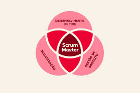
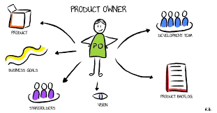
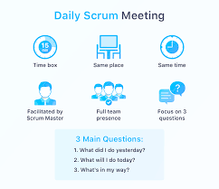

# ***SCRUM***

# **Papéis do scrum**

# ***Papel 1 - Scrum Master***

## Ele é responsável por garantir que o Scrum seja aplicado de maneira correta e impedir interferências externas. Papel de grande destaque porque ele também fica encarregado de mostrar ao time a importância de seguir o método ágil.

# ***Papel 2 - Product Owner***

## O Product Owner, ou PO, é o membro de um time que utiliza Scrum (ou alguma técnica similar) para definir estórias e priorizar o backlog de um produto ou projeto. Ele é responsável por manter a integridade conceitual das novas funcionalidades, bugs ou melhorias, para que essas sigam uma visão definida para o produto ou projeto. Além disso, ele também é responsável pela qualidade final das entregas, sendo o único que deve ter poder de aceitar estórias como concluídas.

# ***Papel 3 - Daily Scrum***

## O Daily Scrum é um evento de 15 minutos para os Desenvolvedores do Time Scrum. Para reduzir a complexidade, ele é realizado no mesmo horário e local todos os dias úteis do Sprint. Se o Product Owner ou Scrum Master estiverem trabalhando ativamente em itens do Sprint Backlog, eles participam como Desenvolvedores.
